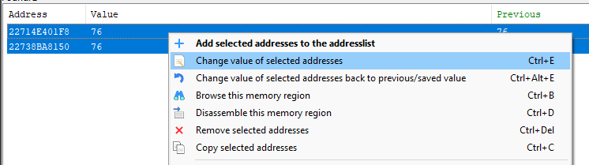
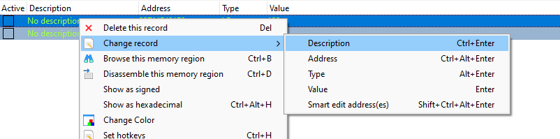

# Cheat Engine 7.4 Basics

## Setup
Ich werde Cheat Engine auf Englisch verwenden, da die Menge an Informationen im Internet für Cheat Engine auf Englisch viel größer ist als auf Deutsch. Daher werden auch alle Buttons oder Namen, die in CE vorkommen, in diesem Blog auf Englisch sein.
Der Blog ist zum Mitmachen gedacht, also probiert selbst aus, was ich hier erkläre.
Falls ihr keines der beiden verwendeten Spiele habt, könnt ihr es gerne in eurem Lieblingsspiel ausprobieren, da die Vorgehensweise im Prinzip immer gleich ist.
### Cheat Engine
Du kannst den Cheat Engine (CE) Installer [hier](https://www.cheatengine.org/) herunterladen.  
Wenn du keine Werbung installieren möchtest, solltest du darauf achten, diese abzulehnen. Werbung ist mit einem "optional offer" in der rechten oberen Ecke gekennzeichnet.
Danach sollte sich CE automatisch installieren und starten.
### Overview
Ich werde mich in diesem Intro zum Game Hacking bzw. Cheating auf Einzelspielerspiele beschränken. Der Grund dafür ist, dass es höchst unwahrscheinlich ist, bei solch einem Spiel verklagt zu werden und es auch einfacher ist. Wenn das Onlinespiel gut geschützt ist, kann es sogar sein, dass diese Art von Cheating garnicht wirklich funktioniert. Generell kann das Wissen über EInzelspielerspiele auf Mehrspielerspiele übertragen werden, es kann hauptsächlich sein, dass der Server merkt dass man cheatet. 

## Theoretische Grundlagen
### Arbeitsspeicher
Jedes Programm, das auf einem Computer läuft, speichert irgendwo seine Daten. Normalerweise werden diese Daten im Arbeitsspeicher abgelegt und bei Bedarf in die CPU geladen. Der Arbeitsspeicher ist in bestimmte Bereiche aufgeteilt, so dass jedes Programm nur seine eigenen Daten sieht. Um dennoch Zugriff auf ein anderes Programm zu erhalten, können Funktionen genutzt werden, die eigentlich Debuggern vorbehalten sind.
Im Prinzip agiert Cheat Engine also als Debugger für das Programm (oder wie es in CE heißt "Process"). So kann sie auf den Speicherbereich des Programms zugreifen und das Programm auch beenden.
### ???
will ich hier noch so protection technices erklären oder zu komplex dann?
### ???
will ich noch erklären wien debugger so mitm progrmam interagieren kann ? (aka. assembly vom programm in runtime anschauen und erklären wie man das nutzen kann?)

## Praktische Beispiele
Um die Knöpfe von Cheat Engine kennen zu lernen, bietet Cheat Engine selbst ein Tutorial an.
Grundsätzlich bietet Cheat Engine viele Ressourcen im Internet und im Tutorial, um die grundlegende Verwendung von Cheat Engine zu verstehen. Dennoch werde ich in diesem Artikel bei Null anfangen.

| Description  | Screenshot  |
| :---------:  | :--------: |
| Nach dem Start von Cheat Engine sollte es ungefähr so aussehen. Oben links kann man nun den Bildschirm mit der Lupe davor auswählen um den Process auszuwählen. |  |
| Hier muss ich nur das von mir gewünschte Spiel (in meinem Fall Balatro) auswählen. |   |

### Balatro
Zuerst werde ich ein einfaches indie game hacken.
Balatro ist ein Singleplayer Indie Game, in dem man ca. 1 Stunde spielt und die besten Pokerhände auswählen muss.
Die einfachen Teile, die man hier cheaten kann, sind die Anzahl der "Hands", die Anzahl der "Discards" und die Menge des Geldes.

Falls ihr eine Diskrepanz in den Screenshots bemerkt (manche sind schwarz, manche weiß), liegt das daran, dass ich ursprünglich die Basics von Cyberpunk beschrieben habe und diese dann bei Balatro weggelassen habe. Später habe ich aber gemerkt, dass das einfache Hacken vielleicht zuerst beschrieben werden sollte und dann ein paar Screenshots fehlen. Diese wurden dann nachträglich auf meinem Laptop (mit Dark Theme) hinzugefügt.

#### Adresse eines Wertes finden
| Description  | Screenshot  |
| :---------:  | :--------: |
| Nach dem Start einer Runde, sehe ich mein erstes Ziel, "14", die Geldmenge. Diesen Wert gebe ich nun rechts in das "Value"-Feld ein und drücke auf "First Scan".  |   |
| Ich habe den ersten Blind erfolgreich beendet und dafür Geld verdient. Nun kann ich den neuen Wert wieder eingeben und auf "Next Scan" drücken.  |   |
| Nun habe ich immernoch ein paar zu viele Adressen. Hier kann ich durch den Kauf von Jokern einfach meine Geldmenge abändern und erneut nach ihr Suchen.  |   |
| Dies kann ich wiederholen bis ich nurnoch 2 oder 3 Adressen übrig habe. In meiner persönlichen Erfahrung habe ich nie mehr als 2 korrekte Adressen gefunden.  |   |
| Nun hat sich ohne mein Zutun der Wert aller Adressen bis auf eine verändert. Um zu prüfen, ob es die richtige Adresse ist, werde ich den Wert abändern.  |   |
| Mit Rechtsklick kann ich ein Menu für die Adresse öffnen und dort "Change Value of selected adresses" auswählen. |  |
| Nach dem Verändern des Wertes, bleibt die Adresse beim neuen Wert, jedoch verändert sich die Geldmenge nicht. Um sicherzustellen, dass das nicht daran liegt, dass das Spiel den Wert nicht immer updated, kaufen wir etwas damit sich der Wert regulär ändert. Auch da hat sich nichts von unserer Änderung auf das Spiel übertragen. |  |
| Bisher haben wir nach Adressen gesucht welche als 4-byte-integer intepretiert den gesuchten Wert gespeichert haben. Es kann jedoch sein, dass andere Datentypen verwendet werden für den gesuchten Wert. |   |
| Versuchen wir es mal mit einem anderen Datentypen, dem double. Heutzutage verwenden viele Spiele für alle zahlenwerte doubles oder floats, weshalb es nciht unwahrscheinlich ist, dass eine ganzzahlige Zahl wie das Geld in Balatro als double repräsentiert ist. |   |
| Ansich fangen wir komplett von vorne jetzt an, mit einem neuen First Scan. |   |
| Und ändern wieder den Wert durch den Kauf oder Verkauf von etwas und scannen dann nach dem Veränderten Wert.  |   |
| Nun da wir wieder einen potentiellen Wert im Adressraum gefunden haben, versuchen wir erneut ihn abzuändern. Diesmal erfolgreich, die Angabe der Geldmenge updated sich direkt im Spiel zum neuen von mir vorgegebenen Wert.  |   |

Jetzt habt ihr ansich die Grundlagen der Verwendung von Cheat Engine bereits gelernt. Leider müsst ihr diesen Vorgang jedes mal, wenn ihr euer Spiel neustartet wieder durchlaufen. Dies liegt daran, dass alle Adressen eines Spiels standardmäßig etwas zufällig offsetted sind im Adressraum. Das heißt, dass nach jedem Start des Spiels, alle Adressen die verwendet werden um einen bestimmten Wert verschoben werden. Dadurch könnt ihr euch nicht einfach die Adresse die ihr gefunden habt einspeichern und damit zufrieden sein.

#### Adresse offsetunabhängig machen
Als nächtes möchte ich euch erklären, wie ihr diesen Offset ignorieren könnt.

| Description  | Screenshot  |
| :---------:  | :--------: |
| Zu aller erst, speichern wir die Adresse in der unten bereits zu sehenden Adressliste. Hierfür müssen wir nur wieder Rechtsklick machen und die Option auswählen. Ausserdem kann man auch Doppelklick auf die Adresse machen. Durch das Speichern in der unteren Liste,geht die Adresse bei einem neuen Scan nicht verloren. |   |
| Als nächstes benennen wir die Adresse um einen Überblick behalten zu können. Hierfür werden wir wieder Rechtsklick klicken und die im Bild gezeigte Option auswählen. ich nenne die Adresse "Money".  |   |
| Nun da wir die Adresse persistent gespeichert haben. können wir einen Pointer scan für diese Adresse durchführen. Dieser sucht nach allen möglichen Pointerkombinationen, welche zu der gewünschten Adresse zeigen. |   |
| Für diesen Scan existieren verschiedene Optionen, für uns wichtig sind später eigentlich nur diese beiden: "Compare results with other saved pointermap" und "Max level"  |   |

Weiter kann ich euch das ganze nicht erklären, da mir die Zeit dazu fehlt und ich auch nicht zum gewünschten Ergebnis kam. Daher werde ich wohl irgendwas auch falsch verstanden haben.

grob müsstet ihr auch mal die pointermap erstellt haben und dann beim scannen for addressees die pointermaps comparen. und theoretisch spuckt es euch dann ein paar pointerketten aus. Praktisch war das bei mir nicht der Fall und ich hab keine Zeit mehr zum Herausfinden weshalb, da ich etwas zu viel Zeit auf Cyberpunk verschwendet habe xD.
#### Andere möglichkeiten Balatro zu hacken
Wenn man Balatros Dateien im File Explorer öffnet, lässt sich eine README finden. Der Inhalt dieser Datei weist klar darauf hin, dass Balatro wohl mit dem Lua-Framework "LÖVE" erstellt wurde.

Wenn man etwas prüft wie das Framework funktioniert, kann man herausfinden bzw. vermuten, dass die lua dateien verpackt in der exe datei existieren.
Abgesehn davon, kann man immer mal versuchen die exe Datei zu begutachten.

Sobald man vollen Zugriff auf den unobfuskierten Code eines Programmes hat, kann man es beliebig verändern.

| Description  | Screenshot  |
| :---------:  | :--------: |
| Man kann EXE-Dateien mit 7zip öffnen um ihren Inhalt zu begutachten |   |
| Als Beispiel dafür, dass ich Balatro beliebig verändern kann, öffne ich die config.lua Datei. |   |
| Es ist wichtig in 7zip die config.lua mit dem Edit knopf wie im Screenshot bzw. mit F4 zu öffnen, und nicht mit Doppelklick. Doppelklick erstellt standardmäßig eine Kopie der Datei, da sie in einem Archiv ist. |   |
| Ich verändere hier jetzt den Titel von "Balatro" zu "Hacked Balatro" und speichere danach. |   |
| 7zip fragt mich ob ich tatsächlich das Archiv verändern möchte. Dies wäre bei einem Doppelklick nicht passiert. |   |
| Anhand des Datums der letzten Dateiveränderung (verglichen mit dem ersten Screenshot des Ordners) ist schon recht sicher, dass die EXE-Datei verändert wurde. |   |
| Um sicherzustellen, dass es tatsächlich geklappt hat, öffne ich das Programm ganz normal über Steam. Wenn man jetzt oben links den Namen des Spiels liest, sieht man, dass meine Veränderung tatsächlich persistent übernommen wurde. (Beziehungsweise bis Steam die Dateie updated durch ein Update oder Verifizierung der Dateien) |   |
| So einfach ist nicht nur Balatro zu hacken, viele Spiele haben ein Teil ihres Codes oder den kompletten Code nicht sehr gut geschützt und sind somit sehr leicht zu hacken. Hier als Beispiel ein Teil des Codes des Bau und Defense Spiels "Scrap Mechanic". Dieses speichert ein großen Teil seiner Spielmechanismen als unobfuskierte JSON-Dateien. |   |

Diese Veränderung von Code beschränkt sich natürlich nicht nur auf den Fenstertitel. Theoretisch könnte ich bei Balatro jetzt auch eine Reverse Shell implementieren, einen Multiplayermodus entwickeln oder einfach ein eigenes Deck (aka. Spielmodus) erstellen.
Gerade ältere Unityspiele, welche noch auf Grundlage von Mono entwickelt wurden, sind sehr anfällig für solche Modifikationen. Mit Programmen wie ILSpy lassen sich die von Unity erstellten dlls einfach dekompilieren und nach belieben abändern. Dies wäre jedoch eher ein Thema für ein anderen Artikel.
#### Weitere Features von Cheat Engine
Cheat Engine unterstützt Hotkeys:

Das hier wäre ein Beispiel womit ich einfach durch das drücken von 1 mir automatisch mein Geld wieder auf 50 setzen kann.
### Cyberpunk
Prinzipiell habt ihr beim Beispiel von Balatro bereits die Basics gelernt, welche ihr auch bei vielen Spielen anwenden könnt.
Trotzdem möchte ich hier noch einmal ein anderes Spiel durchgehen.
Es unterscheidet sich grundlegend von Balatro, da es ein vielfaches komplexer ist und auch aktiv Protections gegen Memory Modification eingebaut hat.

#### Adresse eines Wertes finden
| Description  | Screenshot  |
| :---------:  | :--------: |
| Jetzt möchte ich herausfinden wie ich mir unendlich Leben geben kann. Hierfür nehme ich mein momentanes Leben, welches ich oben links ablesen kann.  |   |
| und gebe diese Zahl bei Cheat Engine ein  |   |
| Nun erschlägt dich erstmal eine immense Menge an Memory-Blöcken. Wie du aber vielleicht bemerkst, ändern sich manche Werte der gefundenen Adressen bereits ohne dass du etwas tust. Das liegt daran, dass du alle Adressen gefunden hast, welche als 4-byte-Integer interpretiert die Zahl 132 gespeichert haben. Die gefundenen Adressen müssen nicht einmal tatsächlich Integer repräsentieren, beispielsweise könnten sie auch Teil eines Strings sein.  |   |
| Nun kommen wir zum nächsten Schritt. Wir müssen irgendwie den Wert des Lebens abändern um einen neuen Scan durchführen zu können. Hierfür springe ich von einem Hochhaus. Leider habe ich einen Perk der dafür sorgt, dass ich direkt wieder heile. Wenn sich der Wert dauerhaft ändert, wird es jedoch schwerer, einen guten Scan durchzuführen. Daher öffne ich das Pause menu mittels ESCAPE |   |
| Nachdem ich nach dem neuen Wert meines Lebens scanne, bleiben bereits nurnoch zwei Adressen übrig. |   |
| Es ist wahrscheinlich, dass eine der Werte ein einfacher Mirror ist, eine solche Memory Struktur findet man häufiger bei Spielen. Wir können einfach mal probieren den Wert beider Adressen abzuändern. |   |
| Obwohl ich den Wert der Adresse auf 5000 gesetz habe, heile ich einfach von 76 weiter zurück auf die 132. Die Werte meiner Adressen wurden einfach zurückgesetzt auf die 76 und haben danach passend zum Lebens-wert hochgezählt auf 132. Daher kann ich mir sicher sein, dass meine Adressen eine Representation des Lebens-werts sind, leider sind sie nicht der Lebens-wert. Irgendwo anders im Memory ist der eigentliche Wert gespeichert und die von mir gefundenen Adressen sind nur Kopien dieses Werts. Um sicherzustellen, dass die Werte nur Kopien sind und das Spiel nicht einfach eine Sicherung gegen über-maximal-Leben hat, setze ich beide Adressen auf 15, leider mit dem gleichen Ergebnis. |   |
| Nur weil diese Adressen nicht der tatsächlich von mir gesuchte Wert sind, heißt nicht, dass sie nutzlos sind. Später werde ich grob erklären inwiefern diese Adressen sogar sehr nützlich sein könnten, aber erstmal zeige ich euch wie ihr die Adressen für einen späteren Zeitpunkt speichern könnt. Dieses Speichern ist extrem wichtig, da ihr sie sonst sobald ihr einen neuen Scan anfangt verlieren würdet. |   |
| Des weiteren ist es sinnvoll, den neuen gespeicherten Adressen einen Namen/Description zu geben, damit man sich in 15minuten nicht fragt was das eigentlich war. Gerade bei komplizierteren Spielen oder wenn man eben mehr als nur einen Wert finden und ändern möchte, ist diese Benennung extrem wichtig. Diese Beschreibung ist auch sehr hilfreich wenn man versucht ASLR zu umgehen. |  |

#### Weitere Infos zur Adressfindung
Theoretisch kannst du sogar beim Initialscan, wenn du tausende Adressen mit diesem Wert hast, alle Adressen einmal ändern und sehen, ob sich dein Leben dadurch ändert. Das machen wir jetzt auch, aber sei gewarnt, das kann das Spiel zum Absturz bringen. Bei Cyberpunk ist das Spiel direkt abgestürzt.
Wenn dieses Editieren funktioniert und das Spiel danach nicht kaputt ist, kann man damit überprüfen, ob das Spiel fortgeschrittene Techniken verwendet, um solche Memory Modifikationen zu verhindern. Wenn sich das Leben selbst dann nicht verändert, das Spiel aber ansonsten einwandfrei funktioniert, ist die einzige logische Schlussfolgerung, dass das Spiel das Leben selbst nicht einfach als Wert im Speicher hat, sondern es auf irgendeine Weise verbirgt.
Um zu lernen, wie CE funktioniert, kann auch eine vorhandene Cheat-Tabelle hilfreich sein.

Man kann den Wert auch finden, indem man "Unknown initial Value" benutzt und dann immer die konkreten Erhöhungen oder Verringerungen angibt. Da ich aber keinen Zugang mehr zu meinem PC habe, kann ich das nicht mehr testen, ob es mit Cyberpunk funktionieren würde.

#### Wieso hat es nicht geklappt
Bei Cyberpunk zum Beispiel ist es tatsächlich so, dass der Health-Wert nicht eins zu eins gespeichert wird und die Anzeige nicht direkt aktualisiert wird, wenn man den Memory ändert.
Hier sehe ich den einzig effizienten Weg, die richtige Adresse zu finden, den CE Debugger und den Memory Viewer zu verwenden. Aber das sprengt langsam den Rahmen dieses Artikels, da er für Leute gedacht ist, die keine Ahnung davon haben. Wenn ich mit dem Debugger und dem Memory Viewer anfange, sollte man schon ein fundiertes Wissen haben, was ASM ist, was die Befehle bedeuten und vor allem wie ein Debugger funktioniert. Kurz gesagt, ich habe die Darstellungen des Lebens gefunden, aber diese sind nicht die wirkliche Wahrheit, sondern nur eine Beschreibung. Mit Breakpoints für diese Adresse kann man überprüfen, was diese Adresse beschreibt. Davon ausgehend sollte man die wirkliche Adresse finden, die tatsächlich das Leben speichert und auch für Dinge wie Schaden und Tod verantwortlich ist.

##### Prüfung der Vermutung
Wenn wir nun einen existierenden CE Table herunterladen und verwenden, können wir unsere Vermutung auch überprüfen. Um ein existierendes CE Table zu verwenden, muss man sich nur das Table irgendwo besorgen, im Forum "fearlessrevolution.com" findet man oft kostenlose CE Tables, und dann einen Doppelklick auf das heruntergeladene machen.
Dann sollte sich CE automatisch öffnen und man muss nur noch wie oben beschrieben das Spiel auswählen.
Beim Cyberpunk Table ist es so, dass man die einzelnen Features aktivieren muss, indem man auf das Kästchen klickt.
Beim CE Table sieht man, dass das Leben als float gespeichert wird und nicht den gleichen Wert hat wie das Leben tatsächlich hat. Außerdem können wir damit überprüfen, ob wir den Wert des Lebens über den Maximalwert setzen können => Nein.
Leider kann ich für diesen Teil keine Screenshots mehr hinzufügen, da ich wieder in Mannheim bin, wo ich keinen Zugang zu einem leistungsfähigen PC habe.
